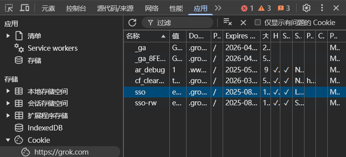

# Grok反代

适用于grok.com的反代

## 使用方式

- `pnpm install`安装依赖（没有pnpm的话npm应该也行）
- `npm run build`或`pnpm build`生成`config.yml`
- 修改`config.yml`
- 获取cookie并放入`cookies`文件夹
- `npm start`或`pnpm start`启动
- 启动后支持继续在`cookies`文件夹中添加或删除cookie，会自动识别

## 配置文件

`config.yml`生成后有完整的注释，查看注释即可。

## 调用方式

不开启`customCookieMode`:

- 使用cookie文件名（不加`.txt`后缀）为key调用则会使用对应文件中的cookie
- 不带任何key（或使用`cookies`文件夹中不存在的文件名为key）则随机选择一个cookie
- 模型不管选什么都会调用grok-3

开启`customCookieMode`:

- 使用cookie的`sso`部分为key调用即可。
  例如：cookie内容为`xxxxxx; sso=aaabbbccc; xxxxxx`，则只需要以`aaabbbccc`为key调用。
  注：也可以加上`sso=`前缀和`;`后缀，会自动识别。

## Cookie获取

登录grok.com并按`F12`打开调试界面

选择调试工具的“应用”一栏，选择`存储/Cookie/https://grok.com`，找到其中名为`sso`的Cookie，复制该值

如果开启配置文件中的`customCookieMode`，直接用复制的这个值作为Key访问反代即可。

如果没有开启，在`cookies`文件夹中建立一个文本文件，命名任意，后缀名需要是`.txt`。在文本文件中输入`sso=刚才复制的值;`并保存。